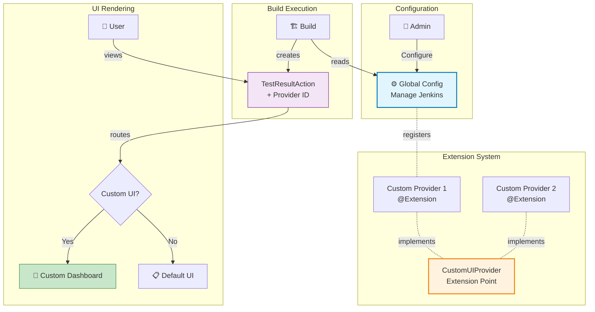
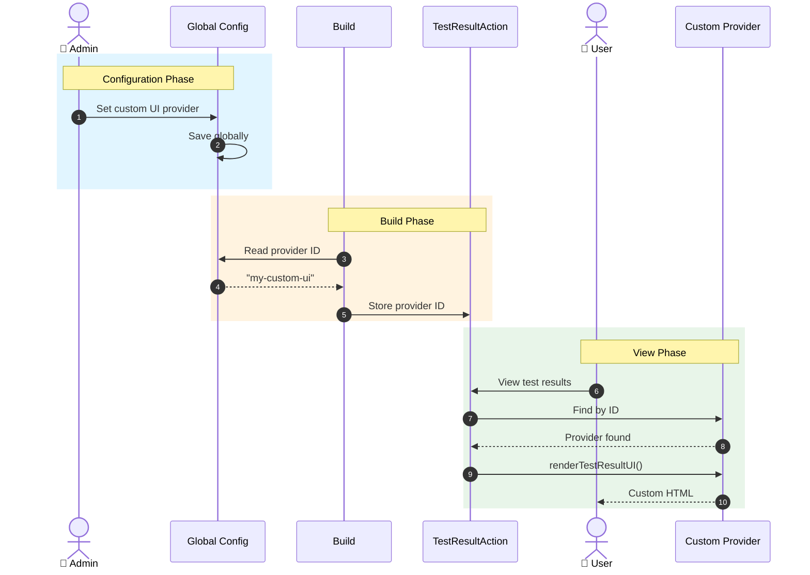
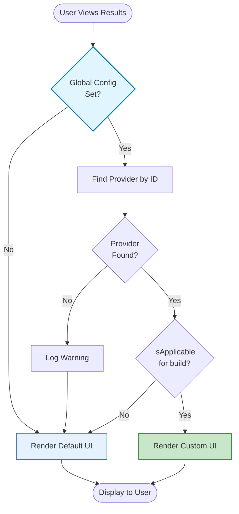

# Custom UI Provider Extension Point

## Overview

The JUnit plugin now supports custom UI providers, allowing external plugins to provide alternative visualizations and dashboards for test results. Administrators can configure a custom UI provider globally, which automatically applies to all jobs across the Jenkins instance.

**Key Benefits:**
- 🎯 **Global Configuration** - Configure once for all jobs
- 🔄 **Automatic Application** - No job modifications needed
- 🔌 **Extensible** - Any plugin can implement custom UI
- 🔙 **Backward Compatible** - Existing setups continue working
- 🛡️ **Safe Fallback** - Reverts to default UI if provider unavailable

---

## Architecture



---

## Complete Flow



---

## Implementation

### Step 1: Create Custom UI Provider

Create a new plugin or add to existing plugin:

```java
package com.example.customplugin;

import hudson.Extension;
import hudson.tasks.junit.CustomUIProvider;
import hudson.tasks.junit.TestResult;
import hudson.model.Run;
import org.kohsuke.stapler.StaplerRequest2;
import org.kohsuke.stapler.StaplerResponse2;
import java.io.IOException;

@Extension
public class MyCustomUIProvider extends CustomUIProvider {

    @Override
    public String getId() {
        return "my-custom-ui";  // Unique identifier
    }

    @Override
    public String getDisplayName() {
        return "My Custom Test Dashboard";  // Shows in dropdown
    }

    @Override
    public void renderTestResultUI(TestResult testResult,
                                   StaplerRequest2 req,
                                   StaplerResponse2 rsp)
            throws IOException {

        rsp.setContentType("text/html;charset=UTF-8");

        // Build your custom UI
        StringBuilder html = new StringBuilder();
        html.append("<!DOCTYPE html><html><head>");
        html.append("<title>Custom Test Dashboard</title>");
        html.append("</head><body>");
        html.append("<h1>Test Results</h1>");
        html.append("<p>Total: ").append(testResult.getTotalCount()).append("</p>");
        html.append("<p>Passed: ").append(testResult.getPassCount()).append("</p>");
        html.append("<p>Failed: ").append(testResult.getFailCount()).append("</p>");
        html.append("</body></html>");

        rsp.getWriter().write(html.toString());
    }

    @Override
    public boolean isApplicable(Run<?, ?> run) {
        return true;  // Apply to all builds, or add custom logic
    }
}
```

### Step 2: Configure Jenkins

1. Go to **Manage Jenkins** → **Configure System**
2. Find **"JUnit Test Results"** section
3. Select your provider from **"Default Custom UI Provider"** dropdown
4. Click **Save**

✅ **Done!** All jobs now use the custom UI automatically.

### Step 3: View Results

No changes needed for jobs or users. Test results automatically render with the configured custom UI.

**Accessing Custom UI:**

When a custom UI provider is configured, users can view test results in two ways:

1. **Embedded in Jenkins UI** (Recommended):
   - Navigate to: `/job/JOB_NAME/BUILD_NUMBER/testReport/`
   - Example: `http://jenkins/job/myJob/42/testReport/`
   - Shows custom UI within Jenkins layout (with sidebar, header, navigation)

2. **Standalone Custom UI**:
   - Navigate to: `/job/JOB_NAME/BUILD_NUMBER/testReport/renderCustomUI`
   - Example: `http://jenkins/job/myJob/42/testReport/renderCustomUI`
   - Shows only the custom UI content without Jenkins chrome

The embedded view uses an iframe to display the custom UI while maintaining the Jenkins interface.

---

## API Reference

### CustomUIProvider (Abstract Class)

Extension point for providing custom UI implementations.

#### Required Methods

| Method | Return Type | Description |
|--------|-------------|-------------|
| `getId()` | `String` | Unique identifier for this provider |
| `getDisplayName()` | `String` | Human-readable name shown in UI |
| `renderTestResultUI(TestResult, req, rsp)` | `void` | Renders custom UI for test results page |

#### Optional Methods

| Method | Return Type | Default | Description |
|--------|-------------|---------|-------------|
| `renderCaseResultUI(CaseResult, req, rsp)` | `void` | Redirects to parent | Renders UI for individual test case |
| `isApplicable(Run run)` | `boolean` | `true` | Check if provider applies to this build |

#### Static Methods

| Method | Return Type | Description |
|--------|-------------|-------------|
| `all()` | `ExtensionList<CustomUIProvider>` | Get all registered providers |
| `findById(String id)` | `CustomUIProvider` | Find provider by ID |

### CustomUIProviderGlobalConfiguration

Global configuration accessible at system level.

#### Methods

| Method | Return Type | Description |
|--------|-------------|-------------|
| `get()` | `CustomUIProviderGlobalConfiguration` | Get singleton instance |
| `getCustomUIProviderId()` | `String` | Get configured provider ID |
| `setCustomUIProviderId(String)` | `void` | Set provider ID |

---

## Configuration

### Global Configuration

**Location:** Manage Jenkins → Configure System → JUnit Test Results

```xml
<!-- config.jelly -->
<f:section title="${%JUnit Test Results}">
    <f:entry title="${%Default Custom UI Provider}" field="customUIProviderId">
        <f:select>
            <f:option value="">${%Default UI}</f:option>
            <!-- Dynamically populated with registered providers -->
        </f:select>
    </f:entry>
</f:section>
```

### Pipeline Example

No configuration needed in pipeline - global config applies automatically:

```groovy
pipeline {
    agent any
    stages {
        stage('Test') {
            steps {
                sh 'mvn test'
            }
        }
    }
    post {
        always {
            // Global custom UI config applies automatically
            junit testResults: '**/target/surefire-reports/*.xml'
        }
    }
}
```

---

## Decision Logic



---

## Implementation Details

### Key Classes

```java
// Extension point
public abstract class CustomUIProvider implements ExtensionPoint {
    public abstract String getId();
    public abstract String getDisplayName();
    public abstract void renderTestResultUI(TestResult, req, rsp);
    public void renderCaseResultUI(CaseResult, req, rsp) { }
    public boolean isApplicable(Run run) { return true; }
}

// Global configuration
@Extension
public class CustomUIProviderGlobalConfiguration extends GlobalConfiguration {
    private String customUIProviderId;
    // getters/setters
}

// Test result action
public class TestResultAction {
    private String customUIProviderId;

    public CustomUIProvider getCustomUIProvider() {
        if (customUIProviderId == null) return null;
        CustomUIProvider provider = CustomUIProvider.findById(customUIProviderId);
        return (provider != null && provider.isApplicable(run)) ? provider : null;
    }

    public boolean useCustomUI() {
        return getCustomUIProvider() != null;
    }
}
```

### Jelly Template Integration

```xml
<!-- TestResult/index.jelly -->
<j:choose>
    <j:when test="${it.useCustomUI()}">
        <!-- Custom UI rendering -->
        <j:invoke on="${it.customUIProvider}" method="renderTestResultUI">
            <j:arg value="${test}" />
            <j:arg value="${request}" />
            <j:arg value="${response}" />
        </j:invoke>
    </j:when>
    <j:otherwise>
        <!-- Default UI rendering -->
        <l:run-subpage>
            <!-- Standard Jenkins UI -->
        </l:run-subpage>
    </j:otherwise>
</j:choose>
```

---

## Files Modified

### New Files (5)

1. `CustomUIProvider.java` - Extension point interface (199 lines)
2. `CustomUIProviderGlobalConfiguration.java` - Global config (92 lines)
3. `CustomUIProviderGlobalConfiguration/config.jelly` - Config UI (21 lines)
4. `CustomUIProviderGlobalConfiguration/help-customUIProviderId.html` - Help (15 lines)
5. `CustomUIProviderTest.java` - Test coverage (277 lines)

### Modified Files (5)

1. `JUnitResultArchiver.java` - Reads global config (+19 lines)
2. `TestResultAction.java` - Custom UI support (+71 lines)
3. `CaseResult/index.jelly` - Conditional rendering (+15 lines)
4. `TestResult/index.jelly` - Conditional rendering (+15 lines)
5. `JUnitResultArchiver/config.jelly` - Removed job-level config (-40 lines)

**Total: 10 files changed, +604 lines added, -40 lines removed**

---

## Security Considerations

⚠️ **Important:** Custom UI providers have full control over HTTP response.

**Implementers must:**
- ✅ Escape all user-generated content (test names, error messages)
- ✅ Use Jenkins' CSRF protection for forms
- ✅ Respect Jenkins authentication/authorization
- ✅ Follow Content Security Policy guidelines
- ✅ Validate input at system boundaries

**Example: Proper escaping**
```java
import hudson.Util;

String escapedName = Util.escape(testResult.getDisplayName());
html.append("<h1>").append(escapedName).append("</h1>");
```

---

## Testing

```java
@Test
public void testGlobalConfigurationAppliedToAction() throws Exception {
    CustomUIProviderGlobalConfiguration config =
        CustomUIProviderGlobalConfiguration.get();

    // Set global configuration
    config.setCustomUIProviderId("my-custom-ui");

    // Create build and action
    FreeStyleBuild build = project.scheduleBuild2(0).get();
    TestResultAction action = new TestResultAction(build, testResult, null);

    // Verify global config is applied
    assertEquals("my-custom-ui", action.getCustomUIProviderId());
    assertTrue(action.useCustomUI());
}
```

Run tests:
```bash
mvn test -Dtest=CustomUIProviderTest
```

---

## Troubleshooting

### Custom UI Not Showing

**Check:**
1. Provider is registered: `CustomUIProvider.all()` returns your provider
2. Global config is set: Check Manage Jenkins → Configure System
3. Provider ID matches: `getId()` returns exact string from config
4. Provider is applicable: `isApplicable(run)` returns true
5. Check logs: Look for warnings about missing providers

### Provider Not Found in Dropdown

**Causes:**
- Plugin not installed or disabled
- Missing `@Extension` annotation
- `getId()` or `getDisplayName()` returns null
- Plugin classloader issues

**Solution:**
```bash
# Restart Jenkins after installing provider plugin
# Check Jenkins system log for extension loading errors
```

### Fallback to Default UI

The plugin automatically falls back to default UI if:
- Provider ID is not configured
- Provider not found by ID
- Provider's `isApplicable()` returns false
- Exception during rendering (logged)

---

## Migration Guide

### From Job-Level Config (if you had custom implementation)

**Before:** Job-level configuration (no longer supported)
```groovy
junit testResults: '*.xml', customUIProviderId: 'my-ui'  // ❌ Removed
```

**After:** Global configuration (automatic)
```groovy
junit testResults: '*.xml'  // ✅ Global config applies automatically
```

**Action Required:**
1. Admin configures custom UI globally
2. Remove any job-level custom UI references
3. All jobs automatically use global config

---

## FAQ

**Q: Can individual jobs override the global setting?**
A: No, this feature uses global configuration only. All jobs use the same custom UI provider.

**Q: Can I have multiple custom UI providers?**
A: Yes, install multiple provider plugins. Admin selects which one to use globally.

**Q: What happens if I change the global config?**
A: New builds will use the new provider. Old builds keep their original provider ID.

**Q: Does this work with pipeline jobs?**
A: Yes, works with freestyle, pipeline, and multibranch pipeline jobs.

**Q: Can I programmatically set the provider?**
A: Yes:
```groovy
import hudson.tasks.junit.CustomUIProviderGlobalConfiguration

CustomUIProviderGlobalConfiguration.get()
    .setCustomUIProviderId("my-custom-ui")
```

---

## Contributing

When developing custom UI providers:

1. **Follow Jenkins conventions** - Use standard Jenkins UI components
2. **Test thoroughly** - Test with various test result scenarios
3. **Document well** - Provide clear documentation for users
4. **Handle errors** - Gracefully handle missing data or failures
5. **Respect permissions** - Check user permissions before displaying sensitive data

---

## Resources

- [Jenkins Extension Points](https://wiki.jenkins.io/display/JENKINS/Extension+points)
- [Jenkins Plugin Tutorial](https://wiki.jenkins.io/display/JENKINS/Plugin+tutorial)
- [Stapler Framework](https://stapler.kohsuke.org/)
- [JUnit Plugin Repository](https://github.com/jenkinsci/junit-plugin)

---

## License

MIT License - See LICENSE file for details

---

**Version:** 1.0
**Last Updated:** 2026-03-30
**Maintained by:** Jenkins JUnit Plugin Team
